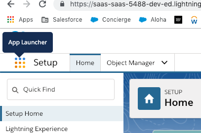
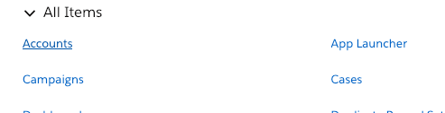
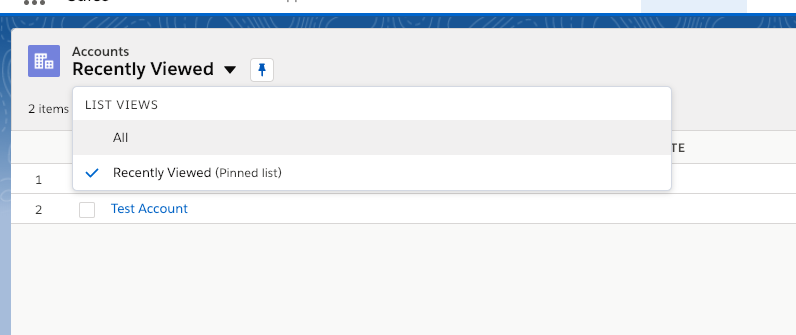
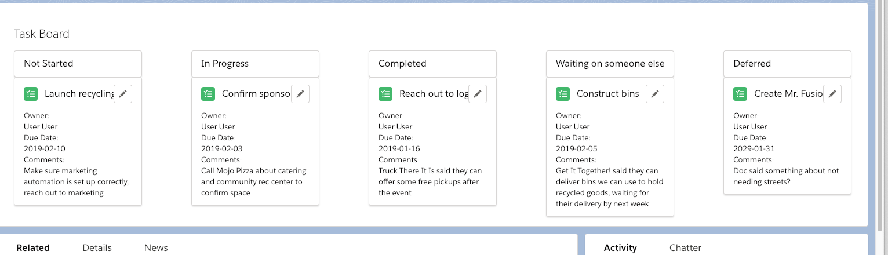
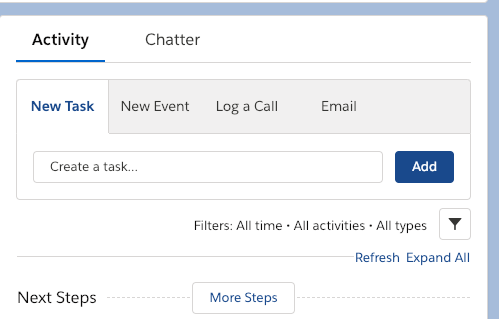

# Salesforce Development Remote Programming Test (RPT)

# Goals
This project is meant to gauge your ability to develop on the Salesforce platform utilizing Lightning Web Components (LWC). The target applicant is someone who has development experience, but not necessarily on the Salesforce platform. By focusing on Lightning Web Components, we hope to provide a project that is grounded in standard JavaScript practices, while also giving the applicant and idea of what it is like to work on the Salesforce platform.

This document provides information on how to set up your machine to do Salesforce development needed for this RPT.

<a href="REQUIREMENTS.md" target="_blank">Click here for the RPT Assignment Details</a>

<a href="https://developer.salesforce.com/docs/component-library/documentation/lwc" target="_blank">Click here for documentation on LWC</a>

Before you start, make sure to fork this repo and pull down to your machine. All instructions assume you are in the base of the project in your terminal.

## Setup (expected time to complete from 20-30 minutes)

### Install tools
First you'll need to install some tools on your machine. Please follow these steps in this Trailhead module to get started:

[Link to Trailhead instructions](https://trailhead.salesforce.com/content/learn/projects/set-up-your-lightning-web-components-developer-tools/install-development-tools?trail_id=build-lightning-web-components)

Make sure you:
* Sign up for [Developer Edition](https://developer.salesforce.com/signup) org
* Enable Dev Hub in that Org
    * From Setup, enter `dev` in the Quick Find box, then click **Dev Hub**. Ensure that **Enable Dev Hub** and **Enable Unlocked Packages** are enabled.
* Install **SFDX CLI**
* Install **Visual Studio Code**
    * While it is possible to use a different IDE/Editor, we will not be able to answer any questions regarding your set up and thus do not recommend doing so for this RPT
* Install the **Lightning Web Components** extension in Visual Studio Code

### Authorize a Dev Hub
First you'll need to Authorize a Dev Hub. A Dev Hub allows you to create scratch orgs, which are basically developer environments hosted on Salesforce.

* In Visual Studio Code, press `Command` + `Shift` + `P` on macOS or `Ctrl` + `Shift` + `P` on Windows or Linux.
* Type `sfdx`.
* Select `SFDX: Authorize a Dev Hub`
* Log in with credentials for your Developer Org with Dev Hub enabled
* Click Allow.
* After you authenticate in the browser, the CLI remembers your Dev Hub credentials and you should a success message in the Output window in VS Code

### Create a Default Scratch Org
A scratch org is an ephemeral salesforce instance that only lasts for 7 to 30 days (based on your settings) that is source control driven, meaning the only things that exist in it are the basic out of Salesforce features and anything you have in version control.

* In Visual Studio Code, press `Command` + `Shift` + `P` on macOS or `Ctrl` + `Shift` + `P` on Windows or Linux.
* Type `sfdx`.
* Select `SFDX: Create a Default Scratch Org....`
* Press Enter to accept the default `project-scratch-def.json`
* Press Enter to accept the default scratch org alias
* Press Enter to accept the default 7 days scratch org duration
* Be patient, creating a scratch org can take a minute. A success message will appear in Output window in Visual Studio Code once complete with a message like `Successfully created scratch org...`

### Push Source to Org
Now you need to push your source code to org.
* In Visual Studio Code, press `Command` + `Shift` + `P` on macOS or `Ctrl` + `Shift` + `P` on Windows or Linux.
* Type `sfdx`.
* Select `SFDX: Push Source to Default Scratch Org`
* Since is this is the first time your pushing your source code to your scratch org, this may take a minute. When complete, you'll see the results in the Output window in Visual Studio Code.
* This is the same command you'll use to push any changes you make your source code. This command does a diff and only pushes code that has actually changed, so subsequent pushes will be faster than the initial one.

### Add Test Data
Add some test data to your org. Run this command from the base folder of your project. It will run a script that inserts data into your scratch org.
`sfdx force:apex:execute -f seed.apex`

### Check Out Your Org in your Browser
* In Visual Studio Code, press `Command` + `Shift` + `P` on macOS or `Ctrl` + `Shift` + `P` on Windows or Linux.
* Type `sfdx`.
* Select `SFDX: Open Default Org`
* Click the grid menu icon next to Setup for to open the App Launcher

    

* Select Accounts

    

* Select the List view `All`

    

* Click on `We Can Can Recycling`
* This is the "Record Page". You should see a basic kanban board like this:

    

* Should you need to add more tasks, you can do so by clicking the "Add" button under "New Task"

    

## Running Tests
To run Apex tests:
* In Visual Studio Code, press `Command` + `Shift` + `P` on macOS or `Ctrl` + `Shift` + `P` on Windows or Linux.
* Type `sfdx`.
* Select `SFDX: Invoke Apex Tests`
* Select the test class you want to run (i.e. `TaskBoardController_TEST`)
* This will run the tests in your scratch org and you will see the results of the tests in VS Code in the Output window

To Run LWC tests locally on your machine:
* Make sure you install <a href="https://nodejs.org/en/" target="_blank">node and npm</a>
* At the base of your project folder run `npm install`
* After that successfully installs, run `npm run test:unit`
* LWC tests are found in the `__tests__` folder in your `lwc` folder. There are some tests in the components folders already to help you get started.
